# Deployment Assignment

---

## 📑 Tasks and Marking Scheme

### Part 1: Local Deployment (10 marks)
- Clone the repository and set up the environment  
- Install dependencies for the backend and both frontends  
- Configure MongoDB connection  
- Start all services and demonstrate that they are working correctly  
  - Backend server running and responding to health checks  
  - Both frontends accessible and able to register users  
  - Data successfully stored in MongoDB  

```
git clone HV_SkillTest_Blue-green-Deployment
cd HV HV_SkillTest_Blue-green-Deployment
```

## added .env files and ran the below commands at backend and frontend folders
```
npm install
npm start
```

```
PS C:\Users\abhis\Harika\skilltest\HV_SkillTest_Blue-green-Deployment\backend> npm start

> registration-backend@1.0.0 start
> node server.js

Backend server running on port 5000
MongoDB connected
PS C:\Users\abhis\Harika\skilltest\HV_SkillTest_Blue-green-Deployment\frontend-blue> npm start

> basic-frontend@1.0.0 start
> node server.js

Basic frontend server running on port 3100
Accessible at http://localhost:3100
PS C:\Users\abhis\Harika\skilltest\HV_SkillTest_Blue-green-Deployment\frontend-green> npm start

> green-frontend@1.0.0 start
> node server.js

Green frontend server running on port 3200
```

> 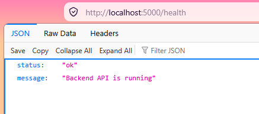
> 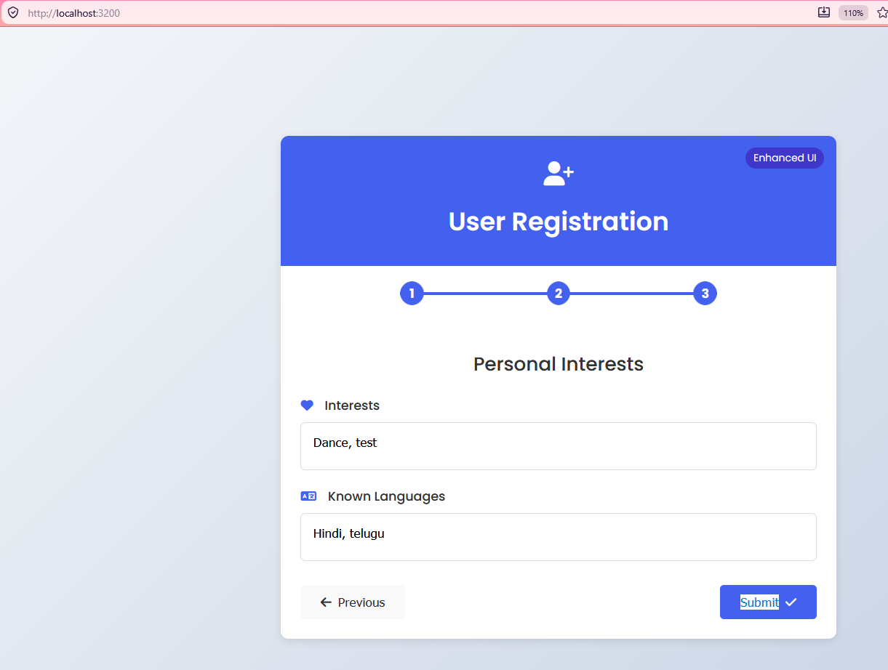
> 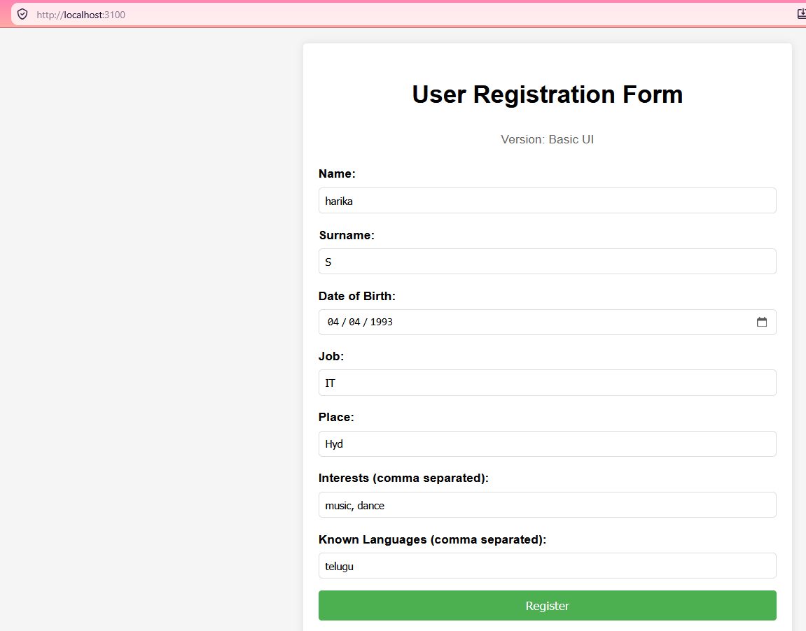
> 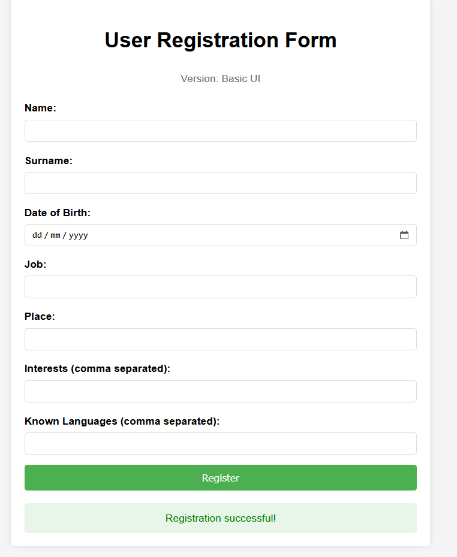
> 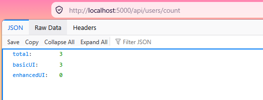
> 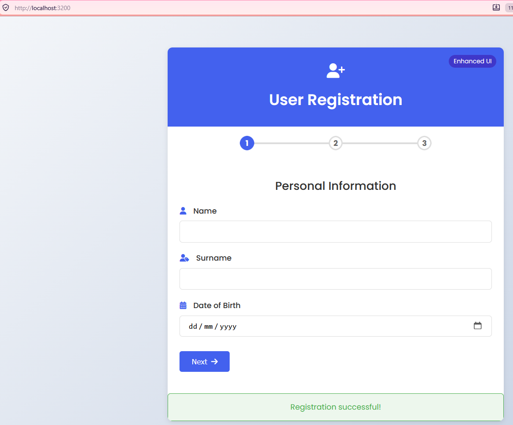
> 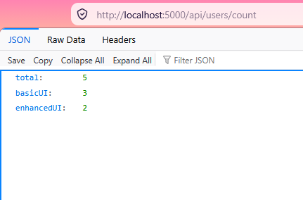
> 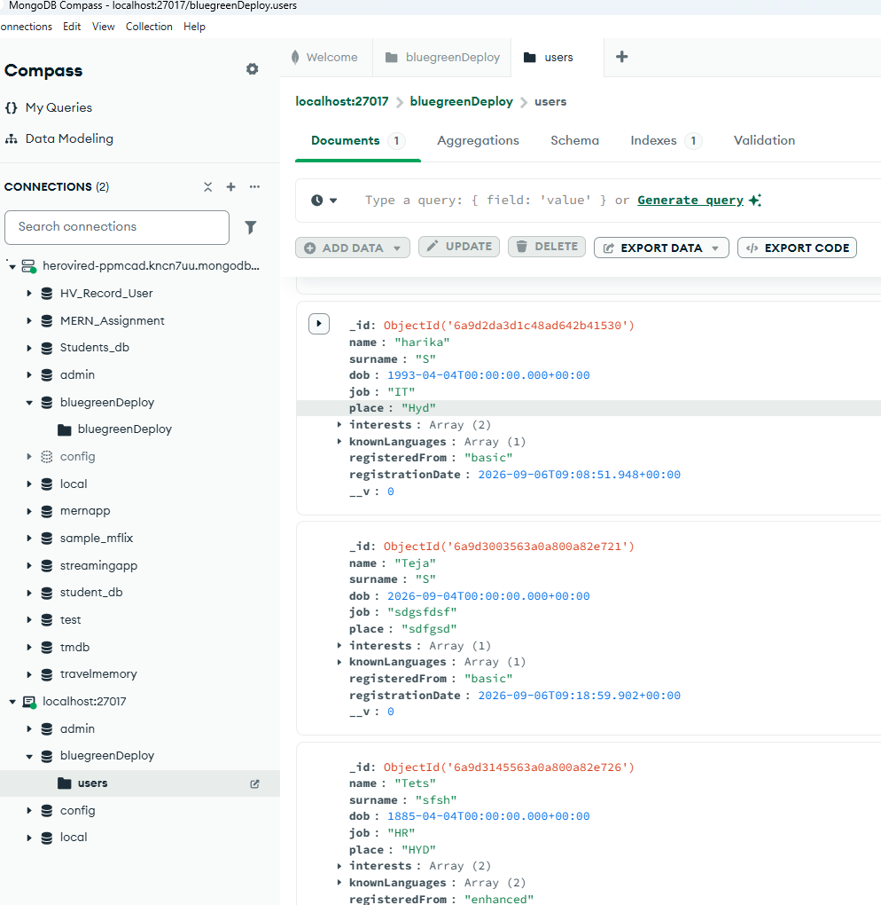
---

### Part 2: Containerization (15 marks)
- Create a **Dockerfile** for the backend service  
- Create **Dockerfiles** for both frontend services  
- Create a **docker-compose.yml** file that runs all services together  
- Build and run the containers locally to verify functionality  

### Docker Files

https://github.com/Harika130822/HV_SkillTest_Blue-green-Deployment/tree/main/Dockerfiles

```
docker-compose up -d

```
> 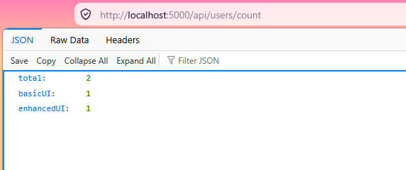
> 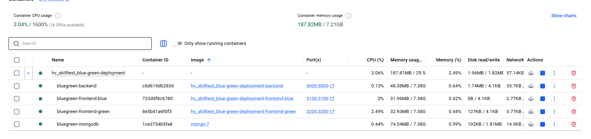

```
docker build -t hv_skilltest_blue-green-deployment-backend:v1 ./backend .
docker build -t hv_skilltest_blue-green-deployment-frontend-green:v1 ./frontend-green
docker build -t hv_skilltest_blue-green-deployment-frontend-blue:v1 ./frontend-blue
```
> 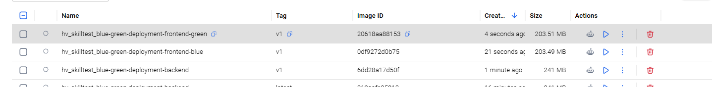

---

### Part 3: Kubernetes Deployment (15 marks)
- Create Kubernetes **Deployment manifests** for all services  
- Create **Service resources** for the applications  
- Deploy the application to **Minikube**  
- Configure proper **health checks** and **readiness probes**  
- Verify that all components are working correctly in the cluster  

---

## files location /k8s/

https://github.com/Harika130822/HV_SkillTest_Blue-green-Deployment/tree/main/K8s

```
kubectl apply -f .\K8s\
```
> 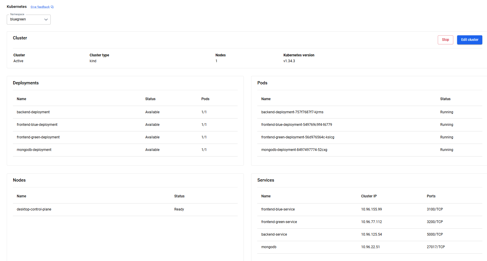
> 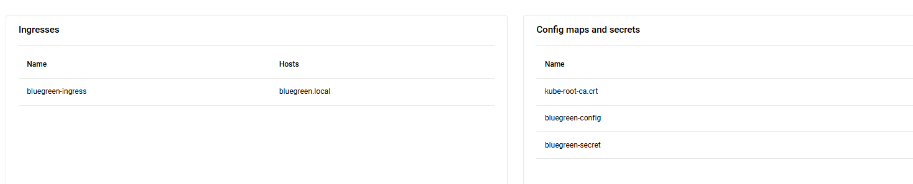
```
PS C:\Users\abhis\Harika\skilltest\HV_SkillTest_Blue-green-Deployment> kubectl get svc -n bluegreen 
NAME                     TYPE        CLUSTER-IP     EXTERNAL-IP   PORT(S)     AGE
backend-service          ClusterIP   10.96.125.54   <none>        5000/TCP    8m59s
frontend-blue-service    ClusterIP   10.96.155.99   <none>        3100/TCP    8m59s
frontend-green-service   ClusterIP   10.96.77.112   <none>        3200/TCP    8m59s
mongodb                  ClusterIP   10.96.22.51    <none>        27017/TCP   2m33s
PS C:\Users\abhis\Harika\skilltest\HV_SkillTest_Blue-green-Deployment> kubectl get deployment -n bluegreen
NAME                        READY   UP-TO-DATE   AVAILABLE   AGE
backend-deployment          1/1     1            1           9m13s
frontend-blue-deployment    1/1     1            1           9m13s
frontend-green-deployment   1/1     1            1           9m13s
mongodb-deployment          1/1     1            1           2m47s
PS C:\Users\abhis\Harika\skilltest\HV_SkillTest_Blue-green-Deployment> kubectl get pods -n bluegreen
NAME                                         READY   STATUS    RESTARTS   AGE
backend-deployment-547858d868-zzmn2          1/1     Running   0          4m17s
frontend-blue-deployment-549769c9f4-t6779    1/1     Running   0          15m
frontend-green-deployment-56d976564c-kslcg   1/1     Running   0          15m
mongodb-deployment-8497497774-52cxg          1/1     Running   0          9m11s
PS C:\Users\abhis\Harika\skilltest\HV_SkillTest_Blue-green-Deployment> kubectl logs backend-deployment-547858d868-zzmn2 -n bluegreen

> registration-backend@1.0.0 start
> node server.js

Backend server running on port 5000
MongoDB connected
```

### ingress
```
kubectl port-forward -n ingress-nginx service/ingress-nginx-controller 8080:80
curl.exe -i -H "Host: blue.localhost" http://127.0.0.1:8080/health
curl.exe -i -H "Host: green.localhost" http://127.0.0.1:8080/health
curl.exe -i -H "Host: blue.localhost" http://127.0.0.1:8080/api/users/count

PS C:\Users\abhis\Harika\skilltest\HV_SkillTest_Blue-green-Deployment> curl.exe -i -H "Host: blue.localhost" http://127.0.0.1:8080/health
HTTP/1.1 200 OK
Date: Sun, 06 Sep 2026 11:06:09 GMT
Content-Type: application/json; charset=utf-8
Content-Length: 85
Connection: keep-alive
X-Powered-By: Express
ETag: W/"55-oC2fEU6Exf98bkE6agE4mMDkkvo"

{"status":"ok","message":"Basic frontend is running","version":"basic","port":"3100"}
PS C:\Users\abhis\Harika\skilltest\HV_SkillTest_Blue-green-Deployment> curl.exe -i -H "Host: blue.localhost" http://127.0.0.1:8080/api/users/count
HTTP/1.1 200 OK
Date: Sun, 06 Sep 2026 11:06:17 GMT
Content-Type: application/json; charset=utf-8
Content-Length: 38
Connection: keep-alive
X-Powered-By: Express
Access-Control-Allow-Origin: *
ETag: W/"26-QQtI/VJvVHafKwyUFL6UnPGetoA"

{"total":5,"basicUI":2,"enhancedUI":3}
```

## port already in use
```
Get-NetTCPConnection -LocalPort 8080 -State Listen -ErrorAction SilentlyContinue | Select-Object LocalAddress,LocalPort,OwningProcess
Stop-Process -Id 26764 -Force
```

```
PS C:\Users\abhis\Harika\skilltest\HV_SkillTest_Blue-green-Deployment> kubectl describe ingress bluegreen-ingress -n bluegreen
Name:             bluegreen-ingress
Labels:           <none>
Namespace:        bluegreen
Address:          localhost
Ingress Class:    nginx
Default backend:  <default>
Rules:
  Host             Path  Backends
  ----             ----  --------
  blue.localhost   
                   /api   backend-service:5000 (10.244.0.22:5000)
                   /      frontend-blue-service:3100 (10.244.0.23:3100)
  green.localhost  
                   /api   backend-service:5000 (10.244.0.22:5000)
                   /      frontend-green-service:3200 (10.244.0.24:3200)
Annotations:       <none>
Events:
  Type    Reason  Age                  From                      Message
  ----    ------  ----                 ----                      -------
  Normal  Sync    2m55s (x3 over 21m)  nginx-ingress-controller  Scheduled for sync
PS C:\Users\abhis\Harika\skilltest\HV_SkillTest_Blue-green-Deployment> 
```
> 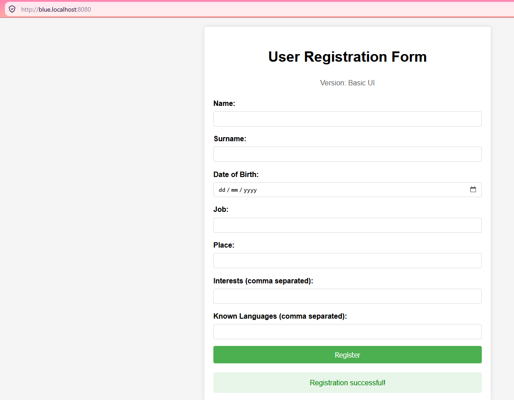
> 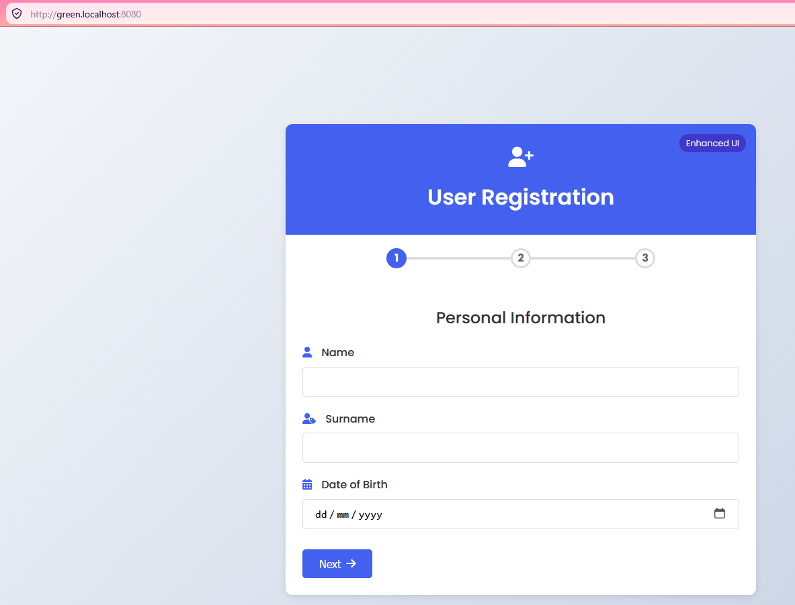

```
PS C:\Users\abhis\Harika\skilltest\HV_SkillTest_Blue-green-Deployment> kubectl delete -f .\K8s\
deployment.apps "backend-deployment" deleted from bluegreen namespace
configmap "bluegreen-config" deleted from bluegreen namespace
deployment.apps "frontend-blue-deployment" deleted from bluegreen namespace
deployment.apps "frontend-green-deployment" deleted from bluegreen namespace
service "frontend-blue-service" deleted from bluegreen namespace
service "frontend-green-service" deleted from bluegreen namespace
service "backend-service" deleted from bluegreen namespace
ingress.networking.k8s.io "bluegreen-ingress" deleted from bluegreen namespace
deployment.apps "mongodb-deployment" deleted from bluegreen namespace
service "mongodb" deleted from bluegreen namespace
namespace "bluegreen" deleted
```

### Part 4: Blue-Green Deployment Implementation (10 marks)
- Create two separate deployments for the **basic** and **enhanced** frontends  
- Implement a service that can switch between the two frontend versions  
- Demonstrate a successful **blue-green deployment switch**  
- Explain your **blue-green deployment strategy** in documentation  

---

## ✅ Evaluation Criteria
- **Functionality:** All services running and accessible  
- **Containerization:** Proper Docker setup and orchestration with docker-compose  
- **Kubernetes:** Correct manifests, services, and cluster validation  
- **Blue-Green Deployment:** Clear demonstration and documentation of strategy  
